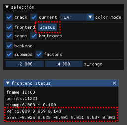

# FAQ

## Debugモード

解決不能な問題が生じたときはデバッグのために ROS param で ```debug=true``` に設定し，ロギングレベルを変更する．細かい粒度のログが表示されるようになるのと同時に ```/tmp/glil_log.txt``` にログファイルが生成されるため，これを症状のレポートと併せてご提出ください．

## IMU関連

角速度が生じるたびに推定が遅くなる・ズレる場合，重力方向に推定が飛んでいく場合などは IMU のセンサ設定が適切になされていない可能性がある．[glim_ext](https://github.com/koide3/glim_ext) の [imu_validator](https://github.com/koide3/glim_ext/tree/master/modules/frontend/imu_validator) モジュールを有効にすることで，IMUの設定が妥当かどうか検証することができる．

imu_validator モジュールを有効にすると標準ビューワ上に推定値を基にIMU加速度値を世界座標系に変換した値がプロットされるため，これが [0, 0, +g] から大きく移動する場合は LiDAR-IMU 相対姿勢設定が誤っている可能性がある．同様にオドメトリ推定によって得られた角速度とIMUで観測された角速度がプロットされるため，これらがおおよそ一致していない場合も相対姿勢設定に誤りがある可能性が高い．

!!!tip
    imu_validator を有効にするには glim_ext をビルドし， ```"libimu_validator.so``` を ```config_ros.json``` 内の ```"glim_ros/extension_modules"``` に追加する．

<div class="youtube">
<iframe width="560" height="315" src="https://www.youtube.com/embed/tsOJHTObuqY" title="YouTube video player" frameborder="0" allow="accelerometer; autoplay; clipboard-write; encrypted-media; gyroscope; picture-in-picture" allowfullscreen></iframe>
</div>

また，標準ビューワ上の ```Status``` ボタンを押して表示される推定結果のIMU速度と実際の運動量に大きな齟齬がある場合や，IMUバイアスが大きすぎる場合 (> 0.5) もIMU設定に問題がある可能性が高い．

