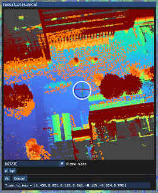

# Initialization proceduce


!!!warn
    Details of this section are revealed for only closed-source users.


## Initial pose with respect to the prior map

地図に対するセンサ姿勢は以下の方法で与えることができる．

### 1. ROS param

ROS param で ```init_by_params=True``` と設定した場合，```init_T_world_imu```を地図に対する初期姿勢とし，Grounded状態で推定を開始する．```init_T_world_imu``` には ```tx,ty,tz,qx,qy,qz,qw``` の姿勢を表す文字列を設定する (数字の間にはカンマのみを置き，スペースを入れてはならない)．

!!!tip
    ```init_T_world_imu```はIMU座標における三次元点```p_imu```を対応する地図座標の点```p_world```に移動する変換である (```p_world = init_T_world_imu * p_imu```)．姿勢形式の変換 (e.g., 4x4 matrix → [trans,quat]) には [Matrix Converter](https://staff.aist.go.jp/k.koide/workspace/matrix_converter/matrix_converter.html) を使用すると良い．

### 2. ROS topics

```/initialpose``` トピック (```geometry_msgs/msg/PoseWithCovarianceStamped```) に初期姿勢として，地図上におけるIMU姿勢を与えることができる．与えられた姿勢から地図に対するスキャンマッチングを行って修正された姿勢が初期姿勢として使用される．同様に ```/initialpose_noalign``` トピックに姿勢を与えた場合はスキャンマッチングを行わず，与えられた姿勢をそのまま初期姿勢として用いる．

!!!tip
    Rviz 上の ```2D Pose Estimate``` ウィジェットを使うことで ```/initialpose``` トピックに姿勢を publish することができる．

### 3. Manual alignment

Standard viewer の ```Manual align``` ボタンを押すことで手動初期姿勢設定モーダルを表示することができる．モーダル上のGizmoを操作することで姿勢を更新し，```align``` ボタンを押すとその姿勢からスキャンマッチングを実行する．得られた姿勢がうまく地図にフィットしていれば ```OK``` ボタンを押すと姿勢推定器が Grounding される．

!!!tip
    手動姿勢設定モーダル下部の ```T_world_imu``` 現在の地図上でのIMU姿勢を表すため，これを Ctrl + C でコピーして ROS param による初期姿勢の設定などに利用することができる．


手動姿勢設定モーダル
